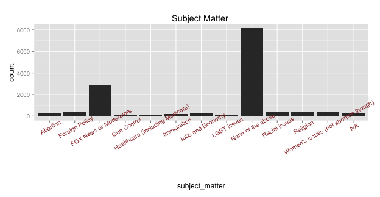
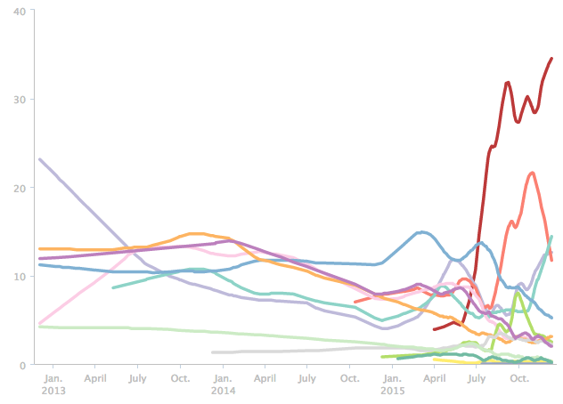
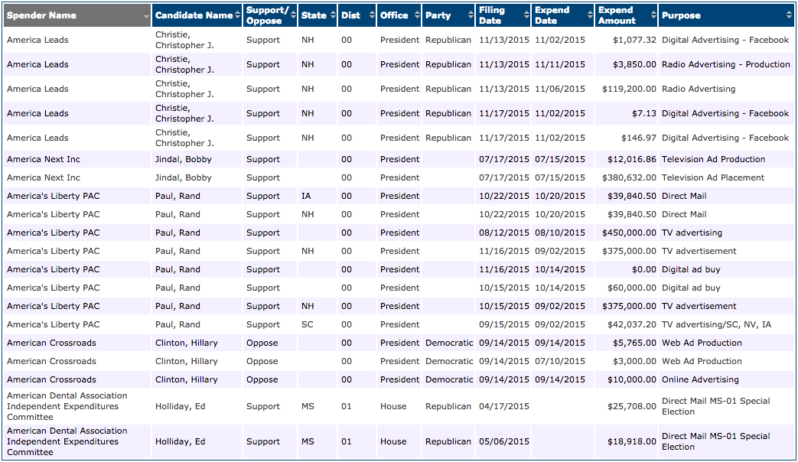
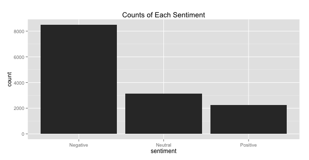
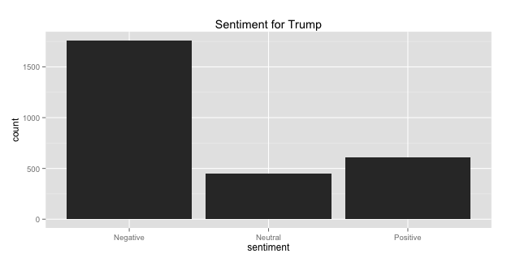
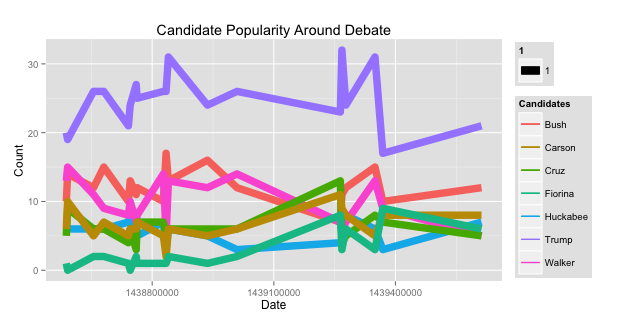
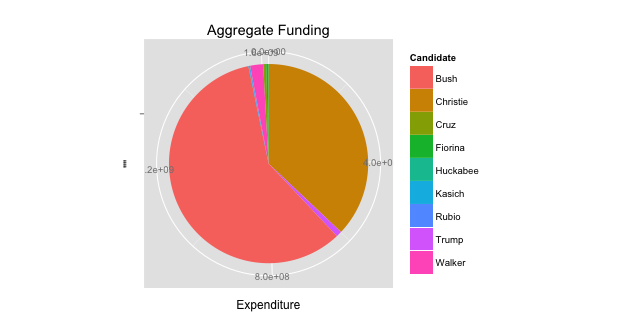
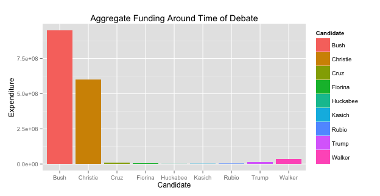
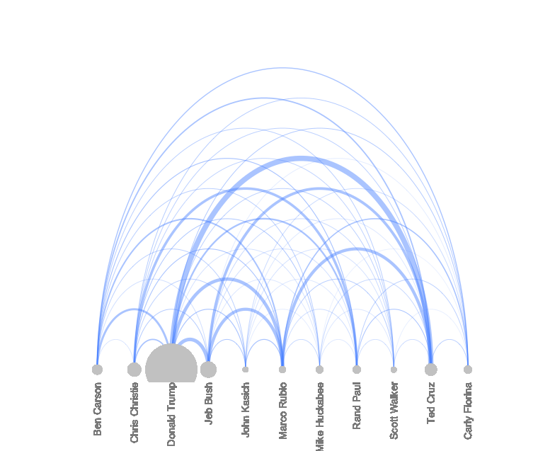

Problem: 

"What exactly indicates how well candidates do in their election campaigns?"
"What would be the most pervasive factor in deciding a landslide victory or a
crushing defeat?"

These are the questions we began with and endevoured to answer through the use of data set analysis. The brainstorm process involved coming up with different aspects of the race that might have an effect on candidates. To this end, we chose to narrow our focus and settled on the GOP, keeping in mind the differences between Republican politics and how it affects the political scene on a national scale. More specifically, we selected the first GOP debate and the time around it as the focal point of our analysis as it is considered a period of peak political activity.

After some preliminary research, we came up with social media as a prime factor, followed by the funding each candidate receives for their campaign and their stances on various societal aspects (our criteria ranged from prevalant sociopolitical to financial issues that would pique voter interest). The latter of these, we found was impossible to analyze as many of the candidates talked about irrelevant issues for the most part of their campaign.

 Description: our analysis of the topics covered in the first GOP debate]

Left with two leads to pursue, we endevoured to seek out datasets that adequately described the aspects described.

We predict that Expenditure and Social Media Outreach (Twitter, in this case), will have a positive impact on how well candidates do. Evidence for this can be found in these articles: 
http://www.opensecrets.org/news/2008/11/money-wins-white-house-and/
https://www.washingtonpost.com/news/the-fix/wp/2014/04/04/think-money-doesnt-matter-in-elections-this-chart-says-youre-wrong/
http://www.pbs.org/newshour/updates/money-pretty-good-predictor-will-win-elections/
http://www.cio.com/article/2976083/social-networking/why-social-media-could-swing-the-2016-presidential-election.html

===================

Description of the Data: 

One of the problems inherent to this sort of analysis is making sure that the data is unaffected by outside factors, as much as possible. Our first and most basic dataset (found here: http://elections.huffingtonpost.com/pollster/2016-national-gop-primary) helps alleviate this problem. It describes how well the candidates did over time and it contains information from 2013 to the present. Given by what we see in the data, the period immediately preceding the start of most campaigning (mid-December 2014, source: https://en.wikipedia.org/wiki/Republican_Party_presidential_primaries,_2016), the polls do not fluctuate, indicating that the campaigns are the major, if not only, reason for a change in the polls. There are some important expections. Carly Fiorina made impressive gains after her debate on the smaller stage. With a very strong performance, it seems like some changes can be made. However, she does fall again in polling, indicating that the debates have the potential of giving a candicate a spotlight, but it is up to the candidate's campaing to keep them in the spotlight. 

 Description: Screenshot of polling data for GOP candidates beginning from January 2013 to the present, source: http://elections.huffingtonpost.com/pollster/2016-national-gop-primary]

We used data from this set as a baseline measure of the candidate's popularity and and their campaign's success. It is continuous data measuring time against polling count (%).

What we saw in this data was that candidate Donald Trump's popularity skyrocketed early June above and far beyond that of any other candidate, followed by candidate Ben Carson more recently.

Our second dataset (found here: http://www.fec.gov/data/IndependentExpenditure.do) highlights the different organizations and corporations (under the "Spender" column) that have donated to individual candidates, the amount of the donations and for what purpose. As mentioned previously, this is one of the factors we decided were important in affecting how well a candidate does and we are comparing it the first dataset in order to determine correlation.

 Description: example snippet of 2nd dataset. we can see here that it includes data for democrat candidates as well, something that will be filtered out during the data cleaning]

What we saw in this set was that Jeb Bush had the greatest amount of funding, followed by Christopher Christie. The dataset we focused on from this is discreet data measuring candidate names against funding ($).

Our third and final dataset (found here: http://www.crowdflower.com/data-for-everyone, titled "First GOP debate sentiment analysis") describes tweets about the candidates made by Twitter users and categorizes them into whether they contain positive or negative sentiments. Its description follows:

"We looked through tens of thousands of tweets about the early August GOP debate in Ohio and asked contributors to do both sentiment analysis and data categorization. Contributors were asked if the tweet was relevant, which candidate was mentioned, what subject was mentioned, and then what the sentiment was for a given tweet. We've removed the non-relevant messages from the uploaded dataset."

We deduced from these data that, overall, sentiment about the GOP was negative. Focusing on Donald Trump as a point of interest, he received more negative sentiment than good.

 Description: overall sentiments towards GOP candidates]

 Description: sentiments towards Trump]

===================

Describe the Analysis Approach 

We first cleaned and prepped the data sets by carrying out small procedures such as removing "$" signs from monetary values and formatting dates to match R's default formatting. After this we created a subset of data to highlight the times around the debate (15 day interval).

We chose to display the polling data as a line graph to suit its continuouns nature. This helps us examine trends over time and allows for an easy comparison between candidates.

 Description: our analysis of the polling data]

From this we can see clearly that Trump's rise in popularity above the other candidates occured right before the GOP debate in August.

For the expenditure data, we produced two graphs: a pie chart displaying the overall funding for each candidate and a bar graph displaying the funding during the days leading upto and after the GOP debate. We thought it would be best to have a pie chart in order to determine fundning each candidate received relative to each other. The bar graph's purpose is to help establish the capacity with which each candidate could build up anticipation for their participation in the debate and how well they could follow up afterwards.

 Description: our analysis of overall expenditure data]

 Description: our analysis of expenditure data in the days around the GOP]

Surprisingly, a conclusion we found was that - contrary to our expectations -  the polling numbers did not correlate with the data. Jeb Bush had the highest amount of funding and yet performed poorly on the polls relative to Trump and Ben Carson. A reason we came up with to account for this was that each of the frontrunner candidates may have received private funding from a source whose information is not publicly available.

Lastly, the Twitter data was used to investigate sentiment (as previously mentioned) as well as volume of tweets directed at each candidate and the relationships between them. A clarification: relationships here is used to refer to how many of the candidates were mentioned together in the same tweet.

 Description: our analysis of the Twitter data]

We compiled the data into an arc diagram in order to best visual these volumes and relational connections. It is evident that Trump, again has the greatest volume and that he and Ted Cruz are talked about the most together. The second highest volume interestingly comes from Jeb Bush.

A point of not here is that, despite initial inclinations to relate how well candidates do in polls to tweet volume (Trump leads in both these fields) Ben Carson here is neither talked about much nor is he talked about in relation to other candidates. This leads us to question the validity of relating any of the previous two datasets to this one as in the previous two Trump and Carson performed similarly. Jeb Bush also performed poorly in polling but was second-best in terms of tweet volume.

Looking at our data through a holistic lens and to answer our initial questions: there does not seem to be a causal relationship between how well candidates do and how much funding they receive, or how much is tweeted about them. Debates only have the ability to make small changes, and this is not tied to expenditure. 

Note: this project is on github so that anyone can utilize our data analysis methods - https://github.com/rollonbears234/stats_proj
